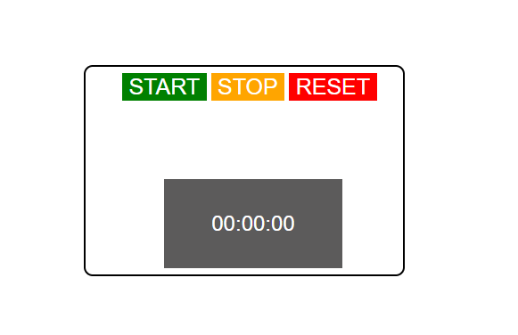

## Simple Stopwatch App

### Three button functionality
#### Start, Stop, and Reset.
Start will start a function that counts based on seconds. Stop will hold your place on the screen. Reset will clear all and end interval. &nbsp;</br>

Flex combined with grid layout make the stopwatch dynamic to any screen. 




Here are some common markdown samples:

```
console.log('code snippet example');
```

Inline `var inlineCodeExample = 2` example.

> Quote something

**bold** text or _italic_

### Different sized header

- Lots of other options are available with markdown! :) 
