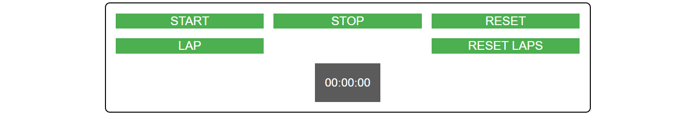

## Simple Stopwatch App

### Five button functionality

+Start - Start will start a function that counts based on seconds.
+Stop - Stop will hold your place on the screen.
+Reset -  Reset will clear all and end interval.
+lap - Lap will display the time from stop watch underneath stopwatch container. The amount of laps is infinite.
+reset lap - Using jQuiry CDN this button clears all of the laps. 

Flex combined with grid layout make the stopwatch dynamic to any screen size. 

