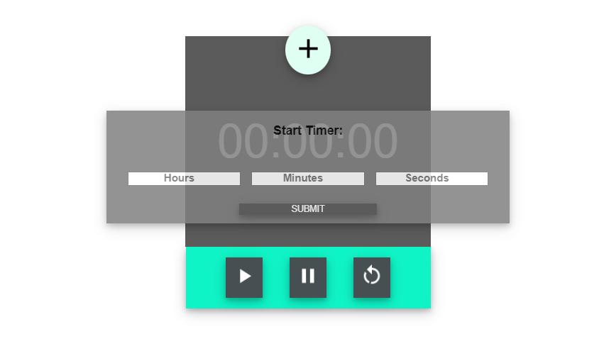

## Simple Stopwatch App. Timer and Alarm pending..

## Stopwatch
### Five button functionality

* Start - Start will start a function that counts based on seconds.
* Stop - Stop will hold your place on the screen.
* Reset -  Reset will clear all and end interval.
* lap - Lap will display the time from stopwatch underneath stopwatch container. The amount of laps is infinite.
* reset lap - Using jQuiry CDN this button clears all of the laps. 

Flex combined with grid layout make the stopwatch dynamic to any screen size. 

## Timer
### Four button functionality

* plus icon - shows hidden form that takes the values of hours, minutes, and seconds.  Upon click of submit button form is hidden, and timer starts passing values to timer screen. 
* play icon - stops the interval and starts a new interval with the current value. 
* pause icon - stops the interval and keeps current value on timer screen. 
* reset icon - stops the interval and resets timer screen to start position.

